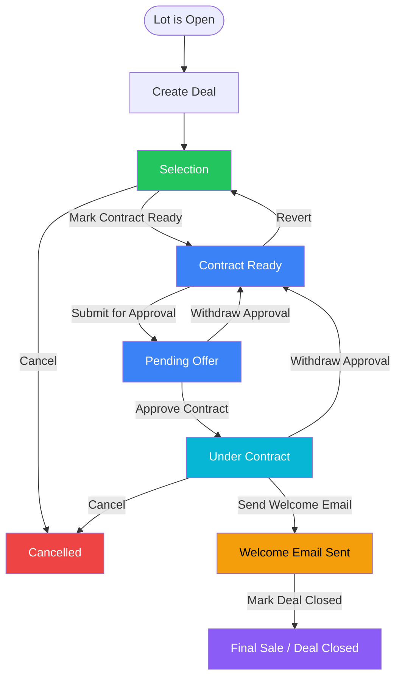
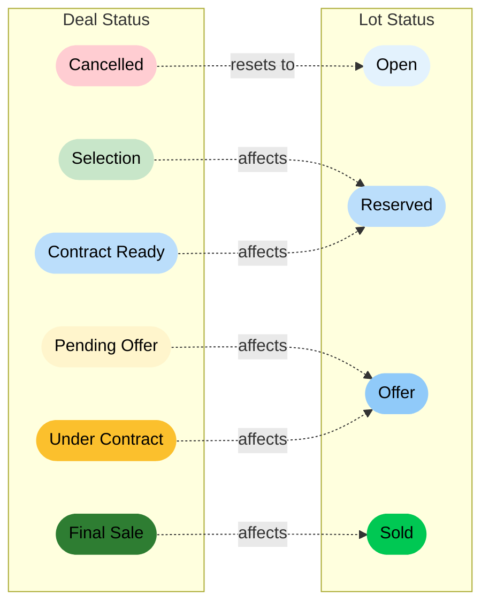
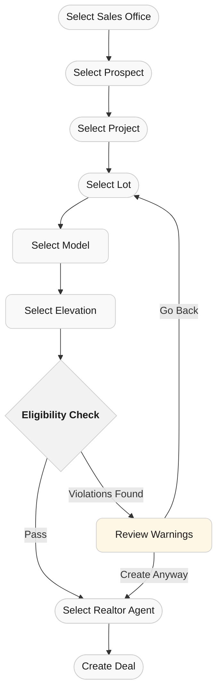
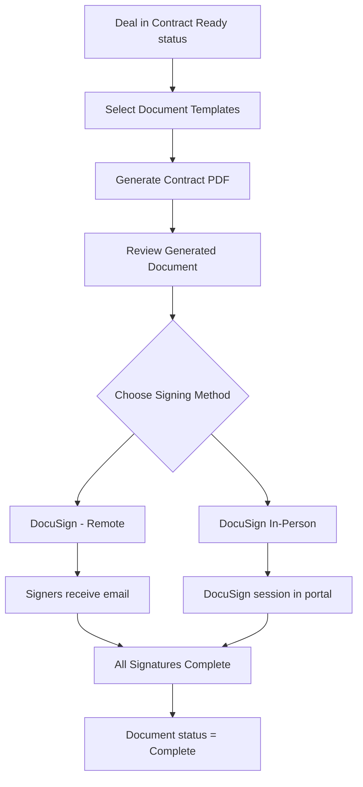
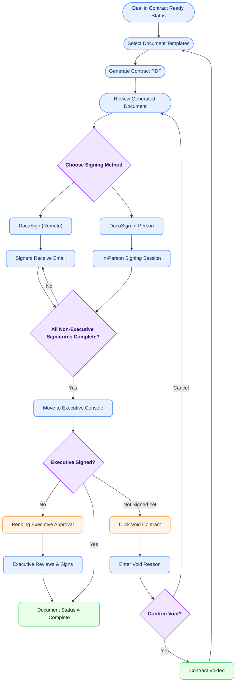
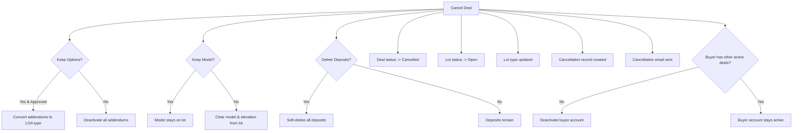
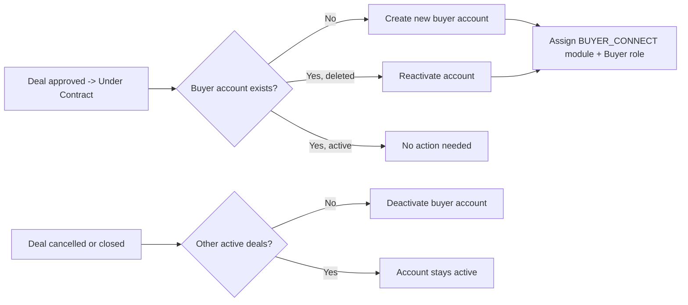

# Deal Lifecycle Guide

> **Audience:** System users (Sales Agents, Admins, Legal Users, Executives, Buyers)
>
> **Purpose:** Complete reference for how deals work in the Treasure Hill Portal - from creation through closing or cancellation, including all restrictions, dependencies, and required actions.

---

## Table of Contents

1. [What is a Deal?](#1-what-is-a-deal)
2. [Deal Lifecycle Overview](#2-deal-lifecycle-overview)
3. [Deal Statuses Explained](#3-deal-statuses-explained)
4. [Step-by-Step: Creating a Deal](#4-step-by-step-creating-a-deal)
5. [Step-by-Step: Moving Through the Lifecycle](#5-step-by-step-moving-through-the-lifecycle)
6. [Document Generation & Signing](#6-document-generation--signing)
7. [Executive Signatures](#7-executive-signatures)
8. [Welcome Email & Deal Closing](#8-welcome-email--deal-closing)
9. [Deal Cancellation](#9-deal-cancellation)
10. [Options & Addendums](#10-options--addendums)
11. [Deposits & Payments](#11-deposits--payments)
12. [Critical Dates](#12-critical-dates)
13. [Co-Buyers](#13-co-buyers)
14. [Sales Agents & Realtor Agents](#14-sales-agents--realtor-agents)
15. [Incentives](#15-incentives)
16. [Buyer Connect Portal](#16-buyer-connect-portal)
17. [Role-Based Access & Permissions](#17-role-based-access--permissions)
18. [What You Can Do at Each Status (Quick Reference)](#18-what-you-can-do-at-each-status-quick-reference)
19. [Common Blockers & Troubleshooting](#19-common-blockers--troubleshooting)
20. [Lot Status Synchronization](#20-lot-status-synchronization)
21. [Email Notifications](#21-email-notifications)
22. [Glossary](#22-glossary)

---

## 1. What is a Deal?

A **Deal** represents a home sale transaction in the system. It connects:

- A **Lot** (the property being sold)
- A **Prospect/Buyer** (the person purchasing)
- A **Model & Elevation** (the home design selected)
- A **Contract** (pricing, dates, legal terms)
- **Documents** (generated contracts for signing)
- **Sales Agents & Realtor Agents** (people involved in the sale)
- **Deposits** (financial payments)
- **Addendums/Options** (upgrades and selections)

A deal is created when a buyer selects a lot and progresses through multiple stages until the sale is finalized or cancelled.

---

## 2. Deal Lifecycle Overview



### Deal & Lot Status Synchronization


## 3. Deal Statuses Explained

| Status | Label in UI | Description | Lot Status |
|--------|-------------|-------------|------------|
| **Selection** | Selection | Initial phase. Buyer has selected a lot. Model and elevation can be changed. Pricing can be set. | Reserved |
| **Contract Ready** | Contract Ready | Selections are locked. Contract can be generated and submitted for approval. | Reserved |
| **Pending Offer** | Pending Offer | Contract has been submitted for approval. Waiting for approval date and approver to be set. | Offer |
| **Under Contract** | Under Contract | Contract is approved. Deal is legally binding. Welcome email can be sent. | Offer |
| **Final Sale** | Deal Closed | Deal has been closed. Lot is sold. | Sold |
| **Cancelled** | Cancelled | Deal has been cancelled. Lot returns to Open. | Open |

### Timeline Progression (as shown in UI)

```
Selection -> Contract Ready -> Pending Offer -> Under Contract -> Welcome Email -> Deal Closed
```

> **Note:** "Welcome Email" is a UI milestone tracked within the Under Contract status (via the `IsWelcomeEmailSent` flag), not a separate database status.

---

## 4. Step-by-Step: Creating a Deal

### Prerequisites

Before you can create a deal, the following **must** be in place:

1. **Lot must be in "Open" status** - You cannot create a deal on a lot that is already Reserved, has an Offer, or is Sold.
2. **Prospect must exist** - The buyer/prospect must already be created in the system.
3. **Prospect must belong to the same Sales Office** as the deal.
4. **Project must be assigned to the Sales Office.**
5. **Sales role users** can only create deals within their assigned projects.

### Creation Steps



1. **Select Sales Office** - Choose the sales office managing this deal.
2. **Select Prospect** - Choose the buyer (must belong to the selected sales office).
3. **Select Project** - Choose the project (must be assigned to the sales office).
4. **Select Lot** - Choose an available (Open) lot from the project.
5. **Select Model** - Choose a home model available for this lot.
6. **Select Elevation** - Choose an elevation for the selected model.
7. **Eligibility Check** - The system checks for rule violations (e.g., incompatible lot/model combinations). If violations are found, you will see a warning modal but can still choose to "Create Anyway".
8. **Select Realtor Agent** - Choose a Realtor Agent for the Deal 
9. **Deal Created** - The system:
   - Sets the deal status to **Selection**
   - Changes the lot status to **Reserved**
   - Assigns you as the **primary sales agent** automatically
   - Links the prospect's realtor (if any) as the primary realtor agent
   - Creates a default contract record
   - Applies the lot premium (if configured) to the contract
   - Sends a deal creation notification email

### Restrictions

| Condition | Result |
|-----------|--------|
| Lot is not Open | Deal creation blocked |
| Prospect not in same Sales Office | Deal creation blocked |
| Project not assigned to Sales Office | Deal creation blocked |
| Sales role user, project not assigned to them | Deal creation blocked |

---

## 5. Step-by-Step: Moving Through the Lifecycle

### 5.1 Selection -> Contract Ready

**Action:** Click "Mark Contract Ready"

**Requirements:**
- Deal must be in **Selection** status
- **Unit Price must be set** (button is disabled if unit price is null)

**What Happens:**
- Deal status changes to **Contract Ready**
- All approved co-buyers are automatically linked to the deal
- Model and elevation can no longer be edited
- Contract generation becomes available

**Who Can Do This:** SuperAdmin, Admin, LegalUser, Sales, Buyer

---

### 5.2 Contract Ready -> Selection (Revert)

**Action:** Click "Revert Contract Ready"

**Requirements:**
- Deal must be in **Contract Ready** status
- No document signing should have been initiated

**What Happens:**
- Deal status reverts to **Selection**
- All contract dates are cleared (Contract Date, Final Sale Date, Approval Date, Target Closing Date, Actual Closing Date)
- Model and elevation become editable again

**Who Can Do This:** SuperAdmin, Admin, LegalUser, Sales, Buyer

---

### 5.3 Contract Ready -> Pending Offer

**Action:** Click "Submit for Approval"

**Requirements:**
- Deal must be in **Contract Ready** status
- **Contract Date must be set**

**What Happens:**
- Deal status changes to **Pending Offer**
- Lot status changes to **Offer**
- Contract is submitted for approval/signing

**Who Can Do This:** SuperAdmin, Admin, LegalUser, Sales

> **Note:** The "Submit for Approval" button only appears when the deal is Contract Ready, a contract date is set, and the deal is not already in Pending Offer.

---

### 5.4 Pending Offer -> Contract Ready (Withdraw)

**Action:** Click "Withdraw Approval"

**Requirements:**
- Deal is in **Pending Offer** or **Under Contract** status

**What Happens:**
- Approval Date and Approver are cleared from the contract
- Deal status reverts to **Contract Ready**
- Lot status reverts to **Reserved**

**Who Can Do This:** SuperAdmin, Admin, LegalUser, Sales

---

### 5.5 Pending Offer -> Under Contract (Approve)

**Action:** Set the Approval Date and Approver on the contract

**Requirements:**
- Deal must be in **Pending Offer** status
- **Both** Approval Date **and** Approved By (user) must be set

**What Happens (automatically when both fields are populated):**
- Deal status changes to **Under Contract**
- Lot's selected model and elevation are set
- **Buyer Connect account** is created or activated for the prospect (see [Buyer Connect Portal](#16-buyer-connect-portal))

**Who Can Do This:** SuperAdmin, Admin, LegalUser, Sales

> **Important:** The transition to Under Contract happens automatically when both the Approval Date and Approved By fields are populated. You don't click a separate "Approve" button - saving the approval details triggers the transition.

---

### 5.6 Under Contract -> Final Sale (Close Deal)

This is a **two-step process**:

#### Step 1: Send Welcome Email

**Requirements:**
- Deal must be in **Under Contract** status
- Welcome email must **not** have been sent already
- User must have the `send-welcome-email` permission

**What Happens:**
- Welcome email with login credentials is sent to the primary buyer
- Welcome email is sent to all active co-buyers
- `IsWelcomeEmailSent` flag is set to true

**Who Can Do This:** SuperAdmin, LegalUser, Sales

> **Note:** Admin role does NOT have the `send-welcome-email` permission by default.

#### Step 2: Mark Deal Closed

**Requirements:**
- Deal must be in **Under Contract** status
- Welcome email **must** have been sent (button won't appear otherwise)
- User must have the `mark-deal-closed` permission
- A closing date must be provided

**What Happens:**
- Contract's Actual Closing Date is set
- Deal status changes to **Final Sale**
- Lot status changes to **Sold**
- Buyer account is deactivated if the prospect has no other active deals

**Who Can Do This:** SuperAdmin, Admin, LegalUser

> **Note:** Sales role does NOT have the `mark-deal-closed` permission.

---

## 6. Document Generation & Signing



### Generating a Contract

1. Navigate to the **Documents** tab in the deal detail.
2. Click **Generate Contract**.
3. Select one or more **document templates** (templates must belong to the deal's project).
4. Optionally insert **custom documents** at specific positions.
5. The system:
   - Merges selected templates into a single document
   - Converts to PDF
   - Extracts signature placeholders from the document
   - Creates signature records for each identified signer

### Signing Methods

| Method | Description |
|--------|-------------|
| **DocuSign (Remote)** | Remote electronic signing. Each signer receives an email from DocuSign with a link to sign. |
| **DocuSign In-Person** | Uses DocuSign's in-person signing flow within the portal. A signing session is opened in the browser for the signer to sign on the spot. |

### Signature Entities (Who Signs)

Signers are identified by entity type:
- **Prospect** - The primary buyer
- **CoBuyer1 / CoBuyer2** - Co-buyers on the deal
- **User** - Internal users (e.g., executives for executive signatures)

### Signature Statuses

| Status | Meaning |
|--------|---------|
| **Pending** | Signature not yet requested |
| **Sent** | Signing request sent to signer |
| **Delivered** | Signer has viewed the document |
| **Complete** | Signer has signed |
| **Declined** | Signer declined to sign |

Here’s a cleaner, concise replacement in the same structured style:

---

### Void Contract

If the Executive has **not signed** the contract yet, it can be voided—even if the Prospect and Co-Buyer have already signed.

* Click **Void Contract** in the top-right corner of the **Documents** tab
* Enter a reason in the **Void Reason** field (required)
* Click **Void Contract** to confirm, or **Cancel** to exit

**Restriction:** Once the Executive signs the contract, the **Void Contract** option is no longer available.

---

## 7. Executive Signatures

Executive signatures are a special part of the signing workflow visible in the **Executive Console** module.

### How It Works

1. After a deal contract is sent for signing, non-executive signers (buyer, co-buyers) sign first.
2. Once all non-executive signatures are complete, the deal appears in the **Executive Console > Pending Approvals**.
3. Executives can:
   - View the document
   - Mark their signature as complete
   - Upload a signed document

### Executive Console Filters

- **Sent** - Shows deals in Pending Offer status where non-executive signatures are done, waiting on executive
- **Complete** - Shows all deals with completed signatures regardless of deal status
  

### Who Can Access

- Executive, SuperAdmin, Admin, LegalUser roles
- Non-admin users only see deals from their assigned projects

### Approval Date Requirement

> **Important:** As of the latest code, the system checks whether the Approval Date has been set before allowing executive signature actions. This ensures the proper approval workflow is followed.

---

## 8. Welcome Email & Deal Closing

### Welcome Email

The welcome email is a **prerequisite** for closing the deal. It serves as the buyer's introduction to the Buyer Connect portal.

**What the email contains:**
- Welcome message
- Login credentials (password is auto-generated or reset)
- Link to the Buyer Connect portal

**Recipients:**
- Primary buyer (prospect)
- All active co-buyers

**Restrictions:**
- Can only be sent when deal is **Under Contract**
- Can only be sent **once** (the button disappears after sending)
- Requires `send-welcome-email` permission (SuperAdmin, LegalUser, Sales)

### Closing the Deal

After the welcome email is sent, the "Mark Deal Closed" button appears.

**What happens on closing:**
- Contract's Actual Closing Date is recorded
- Deal -> **Final Sale**
- Lot -> **Sold**
- If the buyer has no other active Under Contract deals, their Buyer Connect account is deactivated

---

## 9. Deal Cancellation

### When Can You Cancel?

A deal can **only** be cancelled when it is in one of these statuses:
- **Selection**
- **Under Contract**

> **Note:** You **cannot** cancel a deal in Contract Ready, Pending Offer, or Final Sale status. For Contract Ready and Pending Offer, you must first revert/withdraw to Selection or Under Contract.

### Cancellation Options

When cancelling, you must provide the following:

| Field | Required | Description |
|-------|----------|-------------|
| **Cancellation Date** | Yes | The date of cancellation |
| **Cancellation Reason** | No | Select from predefined reasons or enter custom text |
| **Keep Options** | Yes | Whether to preserve approved addendums (converts them to LOA type) |
| **Keep Model** | Yes | Whether to keep the model/elevation assigned to the lot |
| **Delete Deposits** | Yes | Whether to soft-delete all associated deposits |
| **Lot Type** | Yes | The lot type after cancellation (Reg, Spec, or Model) |

### Lot Type Restrictions on Cancellation

The available cancellation options depend on the lot type:

| Lot Type | Keep Model | Keep Options | Delete Deposits |
|----------|-----------|--------------|-----------------|
| **Reg (Regular)** | User can choose | Fixed: true | Fixed: true |
| **Spec** | Locked: true (cannot change) | Locked: true | Locked: true |
| **Model** | Locked: true (cannot change) | Locked: true | Locked: true |

### What Happens When a Deal is Cancelled



### Addendum Handling on Cancellation

- If `keepOptions = true` AND the addendum is both buyer-approved AND builder-approved:
  - The addendum type is converted from **INI** to **LOA** (Letter of Authorization)
  - The addendum is detached from the deal (DealId is removed)
- Otherwise:
  - The addendum is marked as inactive

**Who Can Cancel:** SuperAdmin, Admin, LegalUser, Sales

---

## 10. Options & Addendums

### What are Addendums?

Addendums represent upgrades, selections, and options that a buyer chooses for their home (e.g., upgraded countertops, hardwood flooring, extra fixtures).

### Addendum Types

| Type | Description |
|------|-------------|
| **INI** | Initial addendum - standard selections/upgrades |
| **LOA** | Letter of Authorization - preserved addendum from a cancelled deal |

### Addendum Approval States

Each addendum has two approval gates:

| Flag | Description |
|------|-------------|
| **Buyer Approved** | The buyer has approved the selections |
| **Builder Approved** | The builder has approved the selections |

Both must be approved for the addendum to be considered "in contract".

### Addendum Pricing

Each addendum product has:
- **Unit Price** x **Quantity** = **Amount**
- **Discount** - Direct amount deduction
- **Taxes** - Applied taxes
- **Incentive Amount** - Builder incentive deduction
- **Total** = (Amount - Discount) + Taxes - Incentive Amount

### Addendum Eligibility Scope

Products can be marked as eligible for specific deal phases:
- **Selection** - Only available during Selection phase
- **Contract In Progress** - Only available after contract stage
- **All** - Available at all phases

### Restrictions

- Only **builder-approved** addendums can be cancelled
- Incentive amounts cannot exceed the deal-level incentive limit (see [Incentives](#15-incentives))
- When the model is changed (during Selection), incompatible products are automatically deactivated

---

## 11. Deposits & Payments

### Deposit Types

| Type | Description | Can Link to Addendum? |
|------|-------------|----------------------|
| **Earnest** | Initial good-faith deposit | No |
| **Scheduled** | Installment payments per schedule | No |
| **Options** | Payment for selected upgrades | **Yes (Required)** |
| **Lot** | Lot base price deposit | No |
| **Lot Premium** | Lot premium amount deposit | No |

### Deposit Schedule

Deposits can be auto-generated from a project's deposit schedule:
- Each schedule defines installments with **business day offsets** from the contract date
- The system calculates actual due dates based on the project's country calendar
- **Requirement:** Contract date must be set before generating scheduled deposits

### Payment Tracking

Each deposit can have multiple payments:

| Field | Description |
|-------|-------------|
| **Payment Date** | When the payment was made |
| **Payment Amount** | Must be > 0 |
| **Reference No** | Check/reference number (optional, max 50 chars) |
| **Returned** | Flag if payment was returned/refunded |

### Financial Summary

For each deposit:
- **Scheduled** = Total deposit amount
- **Received** = Sum of non-returned payments
- **Due** = Scheduled - Received

### Receipt Generation

After recording a payment, you can generate a **Receipt of Funds** PDF that includes:
- Purchaser name, vendor/project name, lot number
- Street address, contract date
- Sales representative name
- Payment amount and currency

### Restrictions

| Rule | Details |
|------|---------|
| Cannot delete deposit with active payments | Payments must be removed first |
| Options deposits require addendum link | System enforces this when deposit type is Options |
| Non-options deposits cannot link to addendum | Only Options type supports addendum link |
| Payment amount must be > 0 | Validated on creation |
| Returned payments reduce "Received" total | They subtract from the received calculation |

---

## 12. Critical Dates

The **Critical Dates** tab tracks important closing-related dates for a deal.

> **Restriction:** The Critical Dates tab is **disabled** when the deal is in **Selection** status. It becomes available starting from Contract Ready.

### Closing Types

| Type | Description |
|------|-------------|
| **Tentative (0)** | Closing date is estimated and may change |
| **Firm (1)** | Closing date is fixed and confirmed |

### Date Fields by Closing Type

#### Tentative Closing (Type 0)

| Field | Enabled When |
|-------|-------------|
| First Tentative Actual Date | Always enabled |
| First Tentative Notice Sent Date | Only after First Tentative Actual Date is set |
| Second Tentative Actual Date | After first tentative is set |
| Second Tentative Notice Sent Date | Only after Second Tentative Actual Date is set |
| Firm Actual Date | **Disabled** (tentative closing) |
| Firm Notice Sent Date | Disabled |

#### Firm Closing (Type 1)

| Field | Enabled When |
|-------|-------------|
| Firm Actual Date | Always enabled |
| Firm Notice Sent Date | Only after Firm Actual Date is set |
| First Tentative fields | **All disabled** |
| Second Tentative fields | **All disabled** |

### Additional Date Fields

- **Delayed Date** and notice
- **Termination Date** and notice

---

## 13. Co-Buyers

Co-buyers are additional purchasers on a deal (e.g., spouse, family member).

### Key Behaviors

- Co-buyers are linked through the Prospect -> CoBuyer relationship
- When a deal moves to **Contract Ready**, approved co-buyers are automatically linked to the deal
- Each co-buyer has an `IncludeInContract` flag controlling whether they appear in the generated contract
- Co-buyers receive the welcome email along with the primary buyer
- Co-buyers are tracked as potential signers on deal documents (CoBuyer1, CoBuyer2)

### Management

- Add/remove co-buyers from the **Co-Buyers** tab in the deal detail
- Co-buyers can be linked or unlinked at any time during the deal lifecycle

---

## 14. Sales Agents & Realtor Agents

### Sales Agents

Sales agents are internal team members assigned to a deal.

| Field | Description |
|-------|-------------|
| **Is Primary** | One agent must be the primary (auto-assigned to deal creator) |
| **Sequence Number** | Order among assigned agents |
| **Commission on Base** | Whether agent earns commission on base price |
| **Commission on Options** | Whether agent earns commission on options |
| **Base Commission %** | Percentage commission on base price |
| **Base Commission $** | Fixed amount commission on base price |
| **Option Commission %** | Percentage commission on options |
| **Option Commission $** | Fixed amount commission on options |
| **Notes** | Additional notes |

**Rules:**
- The deal creator is automatically assigned as the primary sales agent
- There must always be one primary agent
- Multiple agents can be assigned to a single deal

### Realtor Agents

Realtor agents are external real estate agents (from agencies) involved in the deal.

They have the same commission structure as sales agents, plus:

| Field | Description |
|-------|-------------|
| **Include In Contract** | Whether the realtor appears in the generated contract |

**Rules:**
- If the prospect has a linked realtor, they are automatically assigned when the deal is created
- Realtors are linked via Agency Realtor records (external agents from real estate agencies)

### Who Can Manage Agents

SuperAdmin, Admin, Sales, LegalUser

---

## 15. Incentives

Deal incentives are builder-provided discounts/offers applied to a deal.

### Incentive Categories

| Category | Description |
|----------|-------------|
| **Lot Price** | Incentive on the lot price |
| **Lot Premium** | Incentive on the lot premium |
| **Base Model** | Incentive on the base model price |
| **Addendum Products** | Incentive on options/upgrades |
| **Total** | Auto-calculated sum of all categories |

### Incentive Validation

The **Addendum Products** incentive acts as a **cap/limit** for individual product-level incentives:
- When applying an incentive to an addendum product, the total of all product incentives **cannot exceed** the deal-level `Addendum Products` incentive amount
- If it would exceed, the system returns an error: *"Incentive amount exceeds the limit"*

### Management

- Incentives are managed from the **Incentives** tab in the deal detail
- At least one incentive field must have a value when creating/updating
- Multiple incentive records are not typical; usually one per deal

---

## 16. Buyer Connect Portal

The Buyer Connect portal is a separate module where buyers can view their deal information.

### Account Lifecycle



### How It Works

1. When a deal reaches **Under Contract**, the system checks if the prospect has a Buyer Connect account.
2. If not, a new user account is created with auto-generated credentials.
3. The **welcome email** (sent separately) delivers the login credentials to the buyer.
4. When a deal is cancelled or closed, the buyer account is deactivated **only if** they have no other active (Under Contract) deals.

### Buyer Access

Buyers can:
- View their under-contract deals
- View deal details, documents, and status

---

## 17. Role-Based Access & Permissions

### Roles That Interact with Deals

| Role | Module | Description |
|------|--------|-------------|
| **SuperAdmin** | All | Full access to everything |
| **Admin** | Administration, Sales | Full deal access, cannot send welcome email or close deal |
| **LegalUser** | Administration, Sales | Can approve contracts, close deals, send welcome email |
| **Sales** | Sales | Can create/manage deals in assigned projects, can send welcome email, cannot close deals |
| **Executive** | Executive Console | Can view and sign deals pending executive signatures |
| **Buyer** | Buyer Connect | Can view own under-contract deals |

### Permission Matrix

| Action | SuperAdmin | Admin | LegalUser | Sales | Executive | Buyer |
|--------|-----------|-------|-----------|-------|-----------|-------|
| View deals | All projects | All projects | All projects | Assigned projects only | Assigned projects | Own deals only |
| Create deal | Yes | Yes | Yes | Assigned projects only | No | No |
| Edit model/elevation (Selection) | Yes | Yes | Yes | Assigned projects | No | No |
| Mark Contract Ready | Yes | Yes | Yes | Yes | No | No |
| Submit for Approval | Yes | Yes | Yes | Yes | No | No |
| Approve Contract | Yes | Yes | Yes | Yes | No | No |
| Withdraw Approval | Yes | Yes | Yes | Yes | No | No |
| Cancel Deal | Yes | Yes | Yes | Yes | No | No |
| Send Welcome Email | Yes | **No** | Yes | Yes | No | No |
| Mark Deal Closed | Yes | Yes | Yes | **No** | No | No |
| Executive Signatures | Yes | Yes | Yes | No | Yes | No |
| Manage Sales Agents | Yes | Yes | Yes | Yes | No | No |
| Manage Realtor Agents | Yes | Yes | Yes | Yes | No | No |
| View Reports | Yes | Yes | Yes | No | No | No |

### Sales Role Specific Restrictions

- Can only access deals within their assigned projects
- Cannot access the Agencies or Realtors management sections directly (redirected)
- Cannot generate deal reports
- Cannot mark deals as closed
- Deal creator is auto-assigned as primary sales agent

---

## 18. What You Can Do at Each Status (Quick Reference)

### Selection

| Action | Available? | Notes |
|--------|-----------|-------|
| Edit Model / Elevation | Yes | Only status where this is allowed |
| Set Unit Price | Yes | Required before moving to Contract Ready |
| Set Reservation Details | Yes | Expiry date, deposit, refundable flag |
| Mark Contract Ready | Yes | Requires unit price to be set |
| Cancel Deal | Yes | |
| Manage Options/Addendums | Yes | Selection-eligible products |
| Manage Deposits | Yes | |
| Manage Co-Buyers | Yes | |
| Manage Sales Agents | Yes | |
| Manage Realtor Agents | Yes | |
| Critical Dates tab | **No** | Tab is disabled |

### Contract Ready

| Action | Available? | Notes |
|--------|-----------|-------|
| Edit Model / Elevation | **No** | Locked |
| Set Contract Date | Yes | Required for submission |
| Generate Contract Document | Yes | Select templates, generate PDF |
| Submit for Approval | Yes | Requires contract date |
| Revert to Selection | Yes | Clears all contract dates |
| Reset Contract Document | Yes | Only if not yet sent for signing |
| Cancel Deal | **No** | Must revert to Selection first |
| Critical Dates tab | Yes | |
| Manage Incentives | Yes | |

### Pending Offer

| Action | Available? | Notes |
|--------|-----------|-------|
| Set Approval Date | Yes | Enables transition to Under Contract |
| Withdraw Approval | Yes | Reverts to Contract Ready |
| Send for Signature | Yes | If document exists |
| Cancel Deal | **No** | Must withdraw to Contract Ready first, then revert to Selection |
| Edit contract fields | **No** | Mostly locked |

### Under Contract

| Action | Available? | Notes |
|--------|-----------|-------|
| Send Welcome Email | Yes | One-time only, requires permission |
| Mark Deal Closed | Yes | Only after welcome email sent, requires permission |
| Withdraw Approval | Yes | Reverts to Contract Ready |
| Cancel Deal | Yes | |
| Manage Documents | Yes | |
| Reassign Buyer | Yes | Only available in Under Contract |
| All form fields | **Read-only** | Most forms are disabled |

### Cancelled

| Action | Available? | Notes |
|--------|-----------|-------|
| All actions | **No** | Deal is in view-only mode |
| All forms | **Disabled** | Everything is read-only |

### Final Sale (Deal Closed)

| Action | Available? | Notes |
|--------|-----------|-------|
| All actions | **No** | Deal is in view-only mode |
| All data | **Viewable** | Everything is accessible for viewing |

---

## 19. Common Blockers & Troubleshooting

### "I can't create a deal"

| Problem | Solution |
|---------|----------|
| Lot shows as unavailable | The lot may already be Reserved/Offer/Sold. Check lot status. |
| Can't see the project | Your user may not be assigned to this project. Ask an admin to assign you. |
| Prospect not found | Ensure the prospect belongs to the same Sales Office you selected. |

### "I can't move the deal to Contract Ready"

| Problem | Solution |
|---------|----------|
| Button is disabled | Set the **Unit Price** in Buyer Selections first. |
| Deal is not in Selection | The deal must be in Selection status. Check current status. |

### "I can't submit for approval"

| Problem | Solution |
|---------|----------|
| Button not visible | Ensure deal is in Contract Ready status and a contract date has been set. |
| Already in Pending Offer | The deal has already been submitted. |

### "I can't approve the contract"

| Problem | Solution |
|---------|----------|
| Approval date field is disabled | Deal must be in Pending Offer status and not cancelled. |
| Deal didn't move to Under Contract | Both Approval Date AND Approved By must be set. Check both fields. |

### "I can't send the welcome email"

| Problem | Solution |
|---------|----------|
| Button not visible | Deal must be Under Contract, email must not have been sent already, and you need the `send-welcome-email` permission. |
| No permission | Only SuperAdmin, LegalUser, and Sales roles can send welcome emails. Admin cannot. |

### "I can't close the deal"

| Problem | Solution |
|---------|----------|
| Button not visible | Welcome email must be sent first. Deal must be Under Contract. |
| No permission | Only SuperAdmin, Admin, and LegalUser can close deals. Sales cannot. |

### "I can't cancel the deal"

| Problem | Solution |
|---------|----------|
| Option not available | Deal must be in Selection or Under Contract status. If it's in Contract Ready or Pending Offer, revert/withdraw first. |

### "I can't edit the model or elevation"

| Problem | Solution |
|---------|----------|
| Fields are read-only | Model and elevation can only be changed during **Selection** status. If the deal has moved past Selection, you must revert it. |

### "I can't access the Critical Dates tab"

| Problem | Solution |
|---------|----------|
| Tab is disabled | Critical Dates are not available during Selection status. Move the deal to Contract Ready or later. |

### "I can't regenerate the contract document"

| Problem | Solution |
|---------|----------|
| Reset not available | The document has already been sent for signing (has an EnvelopeId). You cannot regenerate after signing has been initiated. |

---

## 20. Lot Status Synchronization

The lot status is automatically synchronized with the deal status. You cannot change lot status independently while a deal is active.

| Deal Action | Lot Status Changes To |
|------------|----------------------|
| Deal Created | Open -> **Reserved** |
| Mark Contract Ready | Stays **Reserved** |
| Revert Contract Ready | Stays **Reserved** |
| Submit for Approval | Reserved -> **Offer** |
| Withdraw Approval | Offer -> **Reserved** |
| Approve Contract | Stays **Offer** |
| Mark Deal Closed | Offer -> **Sold** |
| Cancel Deal | Any -> **Open** |

---

## 21. Email Notifications

The system sends automated emails at key deal events:

| Event | Recipients | Content |
|-------|-----------|---------|
| **Deal Created** | Sales users in the project | Deal details, lot, prospect, model info |
| **Deal Cancelled** | Sales users in the project | Cancellation details, reason |
| **Welcome Email** | Buyer + all co-buyers | Login credentials, portal link |
| **Executive Pending Signatures** | Executives, Admins, Legal Users | List of deals awaiting executive signatures |

> **Note:** Email notifications are controlled by workflow configurations. If emails are not being sent, check that the relevant workflow is enabled in the system configuration.

---

## 22. Glossary

| Term | Definition |
|------|------------|
| **Addendum** | A set of options/upgrades selected by the buyer (e.g., flooring, fixtures) |
| **INI** | Initial addendum type - standard selections |
| **LOA** | Letter of Authorization - preserved addendum from a cancelled deal |
| **Buyer Connect** | Portal where buyers can log in and view their deal information |
| **Co-Buyer** | Additional purchaser on a deal (e.g., spouse) |
| **Contract** | The financial and legal record of the deal (pricing, dates, terms) |
| **Critical Dates** | Important closing-related dates (tentative, firm, delayed, termination) |
| **Deal** | A home sale transaction connecting a buyer to a lot |
| **Deposit** | Financial payment made towards the purchase |
| **DocuSign** | Third-party electronic signature service integrated with the system |
| **Earnest Deposit** | Initial good-faith deposit made by the buyer |
| **Elevation** | The exterior design/facade variant of a home model |
| **Envelope** | DocuSign's term for a signing package containing documents and signers |
| **Executive Signature** | Signature from an executive/authorized officer to finalize contracts |
| **Incentive** | Builder-provided discount or credit applied to a deal |
| **Lot** | A specific plot of land/property in a project |
| **Lot Premium** | Additional price charged for desirable lot features (corner lot, backing onto park, etc.) |
| **Model** | A home design/floor plan offered in a project |
| **Prospect** | A potential buyer/customer in the system |
| **Sales Office** | A physical or organizational unit that manages sales for specific projects |
| **Unit Price** | The base purchase price of the property |

---

> **Document generated from codebase analysis on 2026-04-03.**
>
> **Areas that may need verification or additional detail:**
> - Exact wording/content of email templates (templates exist but content was not fully extracted)
> - Specific cancellation reason codes available in the system (populated via database seed data)
> - Detailed decor consultant workflow (referenced in tabs but not deeply explored)
> - Buyer Connect portal features beyond deal viewing (may have additional capabilities)
> - Reassign Buyer tab functionality details (endpoint exists for Under Contract deals only)
> - Tax calculation details on addendum products (tax engine logic not fully explored)
> - Project-level deposit schedule configuration (admin-side setup not covered)
> - Lot Communication tab functionality (appears to be a messaging/notes feature)
